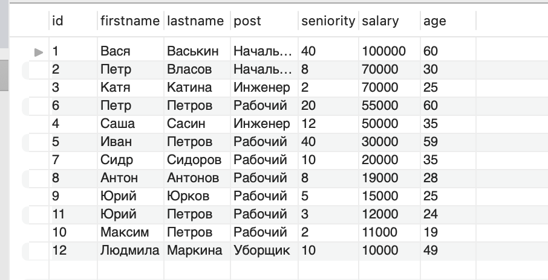
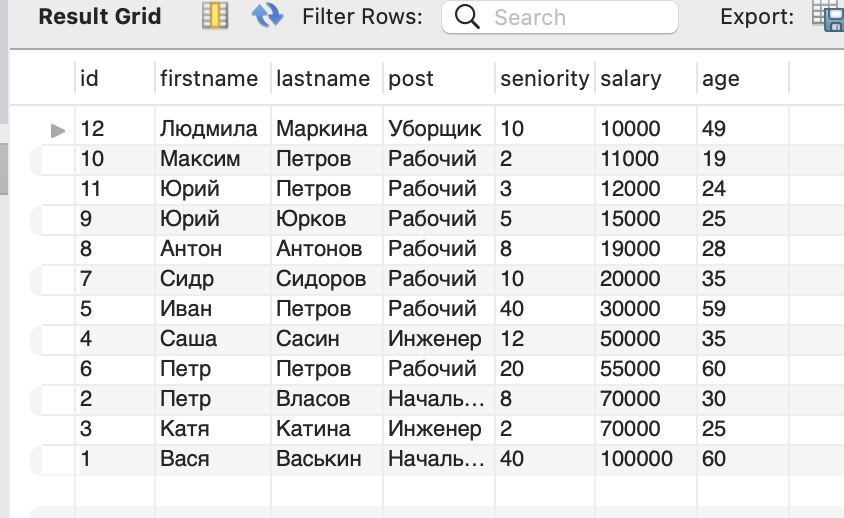
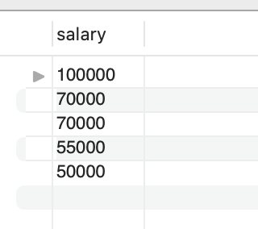
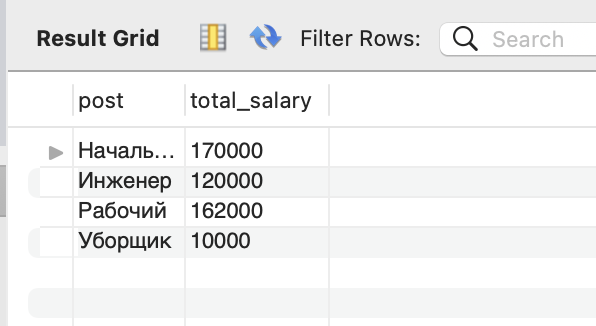
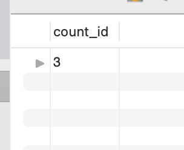
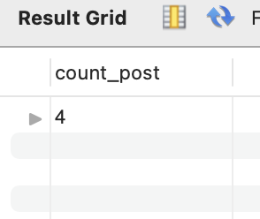
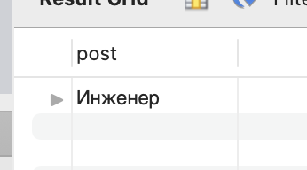
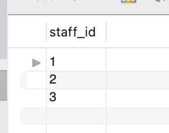
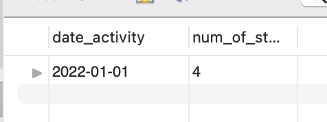
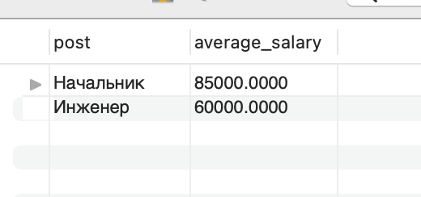

## Условие по таблице staff:
#### 1.1-1.2. Отсортируйте данные по полю заработная плата (salary) в порядке: убывания; возрастания

#### 2.Выведите 5 максимальных заработных плат (salary)   

#### 3.Посчитайте суммарную зарплату (salary) по каждой специальности (роst)

#### 4.Найдите кол-во сотрудников с специальностью (post) «Рабочий» в возрасте от 24 до 49 лет включительно.   

#### 5.Найдите количество специальностей  

#### 6.Выведите специальности, у которых средний возраст сотрудников меньше 30 лет включительно

#### 7.Выведите id сотрудников, которые напечатали более 500 страниц за всех дни

#### 8.Выведите дни, когда работало более 3 сотрудников Также укажите кол-во сотрудников, которые работали в выбранные дни.  

#### 9.Выведите среднюю заработную плату по должностям, которая составляет более 30000
