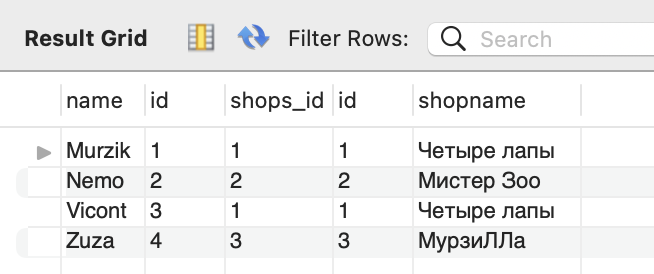
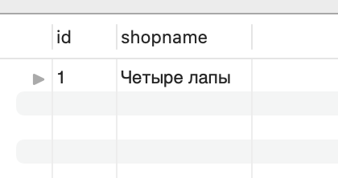
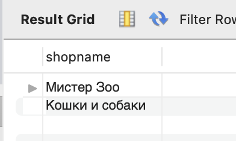
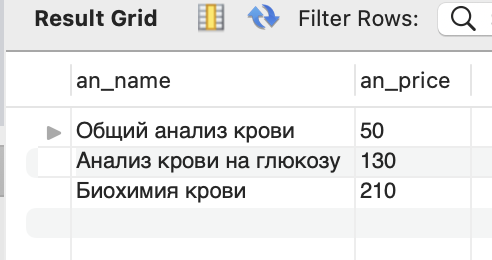

## Условие:
#### Используя JOIN-ы, выполните следующие операции:
### 1.Вывести всех котиков по магазинам по id (условие соединения shops.id = cats.shops_id)

### 2.Вывести магазин, в котором продается кот “Мурзик” (попробуйте выполнить 2 способами)

### 3.Вывести магазины, в которых НЕ продаются коты “Мурзик” и “Zuza”

### 4.Вывести название и цену для всех анализов, которые продавались 5 февраля 2020 и всю следующую неделю.
